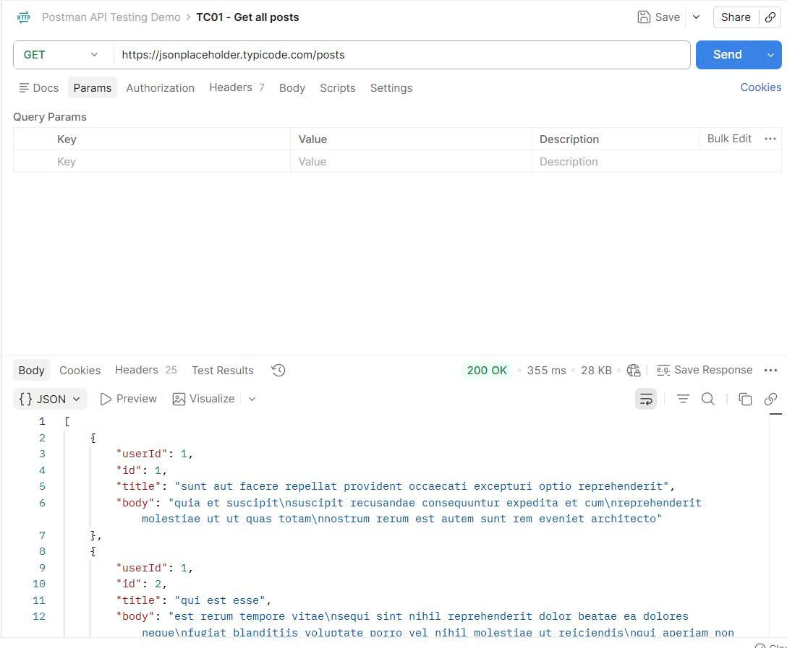
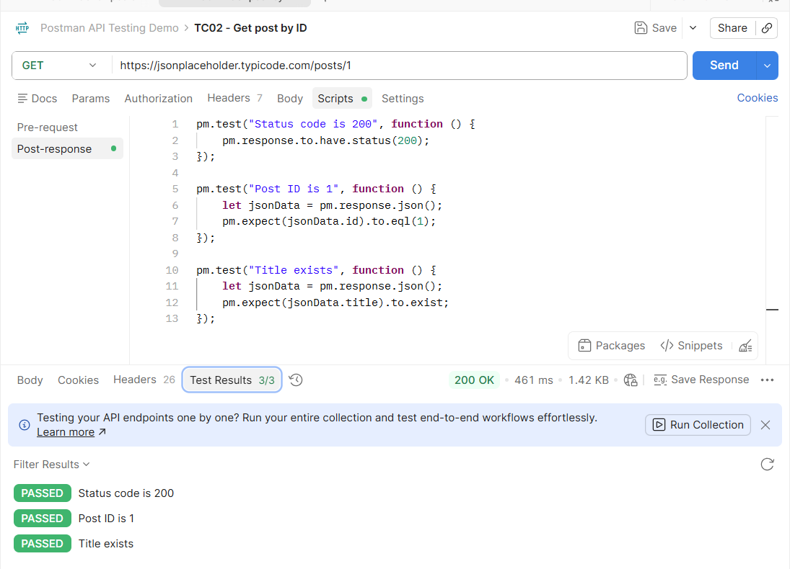
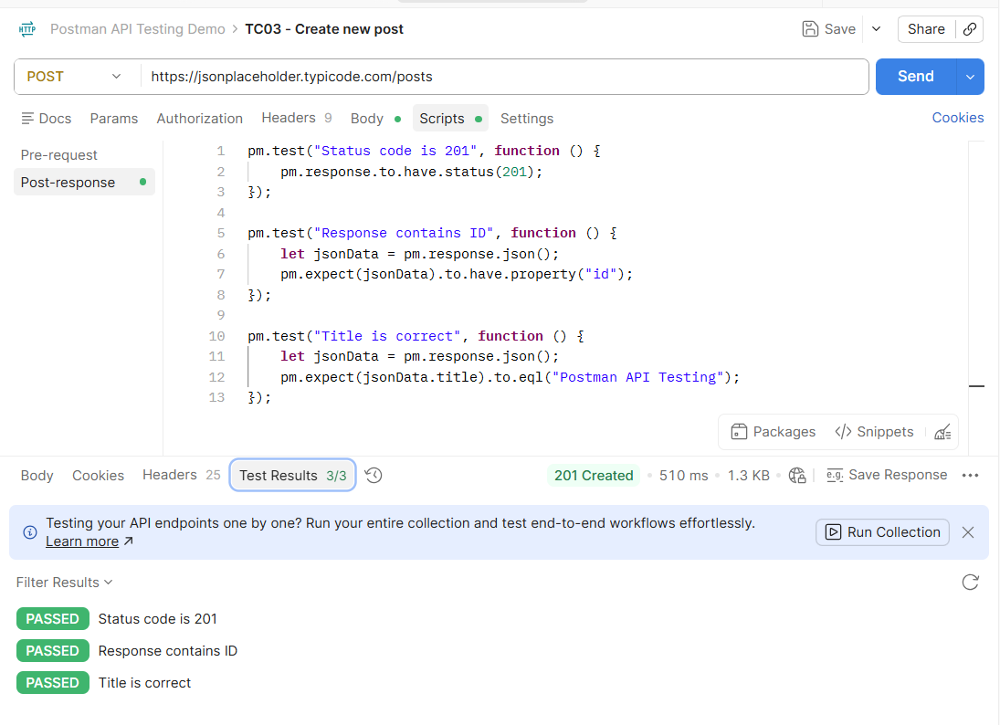
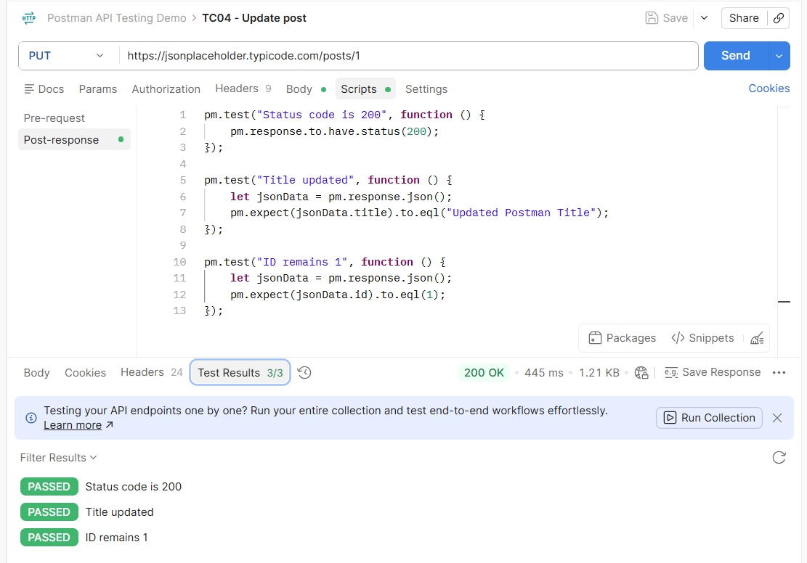
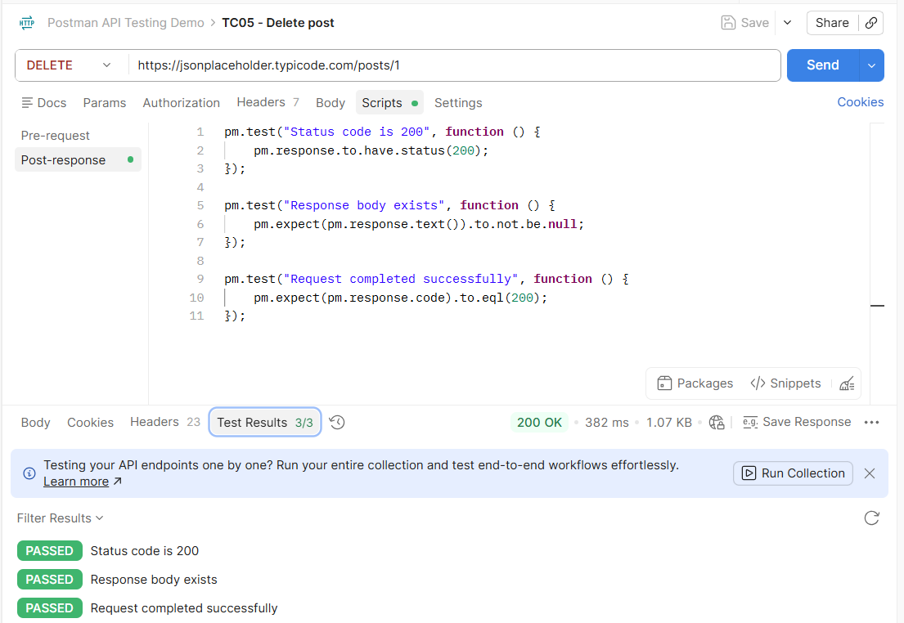
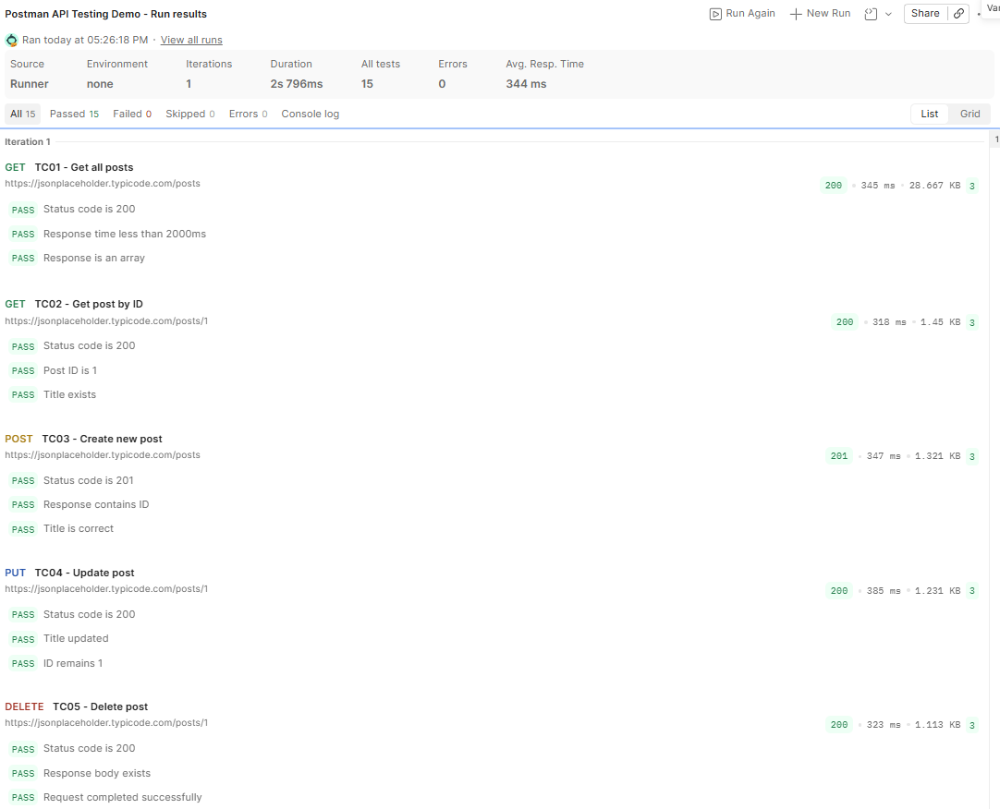

# Postman API Testing Demo

## 1. Giới thiệu

### 1.1 Mục tiêu

Dự án được thực hiện nhằm tìm hiểu và thực hành công cụ kiểm thử API Postman. Thông qua bài thực hành, sinh viên làm quen với việc gửi request, kiểm tra phản hồi từ API và xây dựng các kịch bản kiểm thử tự động bằng Test Script.

### 1.2 API sử dụng

API được sử dụng trong bài thực hành:

https://jsonplaceholder.typicode.com

JSONPlaceholder là một REST API miễn phí thường được sử dụng để học tập và kiểm thử API.

# 2. Công cụ sử dụng

* Postman
* JSONPlaceholder API
* GitHub
* GitHub Desktop / Git


# 3. Danh sách Test Case

## TC01 - Get all posts

### Mục đích

Kiểm tra chức năng lấy danh sách bài viết.

### Request

```http
GET /posts
```

### Kiểm tra

* Status Code = 200
* Response Time < 2000 ms
* Response trả về mảng dữ liệu

### Kết quả

PASS




## TC02 - Get post by ID

### Mục đích

Kiểm tra chức năng lấy bài viết theo ID.

### Request

```http
GET /posts/1
```

### Kiểm tra

* Status Code = 200
* ID = 1
* Title tồn tại

### Kết quả

PASS




## TC03 - Create new post

### Mục đích

Kiểm tra chức năng tạo bài viết mới.

### Request

```http
POST /posts
```

### Dữ liệu gửi

```json
{
  "title": "Postman API Testing",
  "body": "Created by Postman",
  "userId": 1
}
```

### Kiểm tra

* Status Code = 201
* Response có trường ID
* Title trả về đúng

### Kết quả

PASS




## TC04 - Update post

### Mục đích

Kiểm tra chức năng cập nhật bài viết.

### Request

```http
PUT /posts/1
```

### Dữ liệu gửi

```json
{
  "id": 1,
  "title": "Updated Postman Title",
  "body": "This post has been updated",
  "userId": 1
}
```

### Kiểm tra

* Status Code = 200
* Title được cập nhật
* ID vẫn bằng 1

### Kết quả

PASS




## TC05 - Delete post

### Mục đích

Kiểm tra chức năng xóa bài viết.

### Request

```http
DELETE /posts/1
```

### Kiểm tra

* Status Code = 200
* Response tồn tại
* Request thực hiện thành công

### Kết quả

PASS




# 4. Kết quả Collection Runner

Sau khi hoàn thành các request và test script, Collection Runner được sử dụng để thực thi toàn bộ các test case.

### Kết quả

* Tổng số Request: 5
* Tổng số Test: 15
* Passed: 15
* Failed: 0
* Errors: 0
* Average Response Time: 344 ms




# 5. File đính kèm

Repository bao gồm:

* Postman Collection Export (.json)
* README.md
* Hình ảnh minh họa kết quả thực hiện


# 6. Kết luận

Qua bài thực hành, sinh viên đã tìm hiểu và sử dụng thành công Postman để kiểm thử API REST.

Các chức năng GET, POST, PUT và DELETE đã được thực hiện thành công trên JSONPlaceholder API. Toàn bộ 15 test tự động đều đạt kết quả PASS, chứng minh các request hoạt động đúng như mong đợi.

Kết quả cuối cùng:

* 5 API Requests
* 15 Assertions
* 15/15 Tests Passed
* 0 Errors
* 100% PASS

